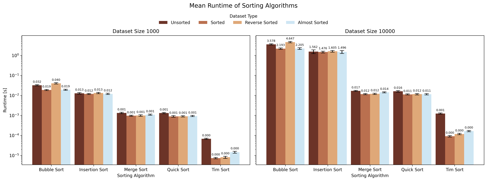
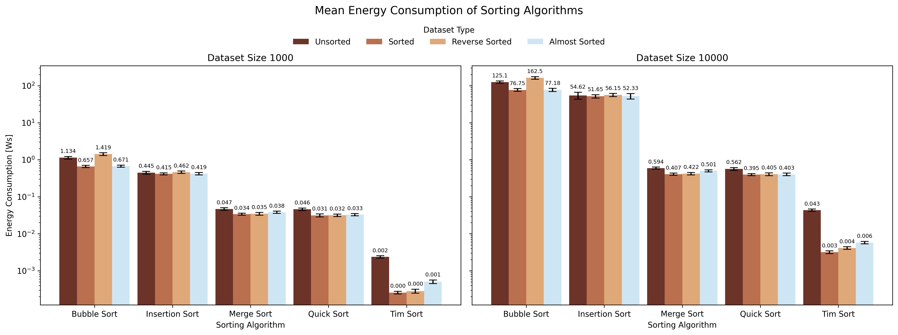
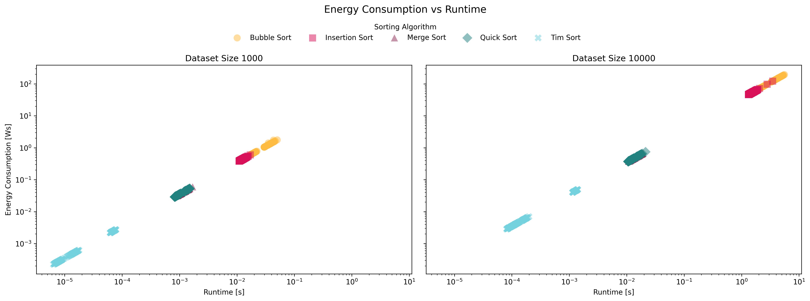

# Energy efficiency of Sorting Algorithms
This project analyzes and compares the runtime and energy efficiency of various sorting algorithms implemented in Python.

The goal is to evaluate not only computational performance but also the energy consumption associated with each algorithm under different input conditions.

## Scope
- Implementation of multiple sorting algorithms (e.g., Bubble Sort, Insertion Sort, Merge Sort, Quick Sort)
- Benchmarking runtime across varying input sizes and distributions
- Estimating energy consumption during execution via CodeCarbon
- Comparing trade-offs between speed and energy efficiency

## Methodology

This project evaluates the runtime and estimmated energy consumption of five sorting algorithms: Bubble Sort, Insertion Sort, Merge Sort, Quick Sort, and Python's built-in sort.

Experiments were conducted using randomly generated integer arrays with sizes of 1,000 and 10,000 elements. Four different input data distributions were considered:
  - Unsorted (random)
  - Already sorted
  - Reverse sorted
  - Nearly sorted

Each algorithm was executed on all dataset types, and both runtime and energy consumption were recorded.

Energy measurements were performed using CodeCarbon. However, due to compatibility issues with macOS and powermetrics, the CPU was not automatically detected. As a workaround, a constant power consumption model of **50 watts** was assumed for all computations.

This means that energy results are directly proportional to runtime and do not reflect real dynamic CPU power behavior.

## Results

   
  <em>Runtime Comparison</em>

   
  <em>Energy Consumption Comparison</em>

   
  <em>Energy vs Runtime</em>

Since a constant power model was used, the energy consumption graphs closely mirror the runtime results.

## Limitations
- The energy measurements are based on a **fixed power assumption** (50W) rather than real hardware measurements.
- CodeCarbon could not access CPU-speciifc power metrics due to macOS powermetrics integration issues.
- Energy consumption values are estimates, not precise measurements.
- The model does not account for CPU load variation, frequency scaling, thermal effects or background processes.

Therefore, conclusions about energy efficiency should be interpreted cautiously.

## Key Insights

## Future Work
